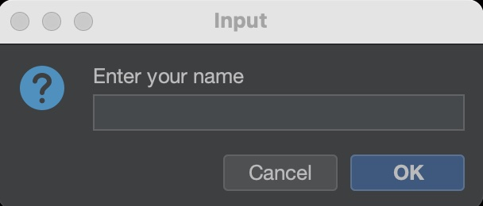
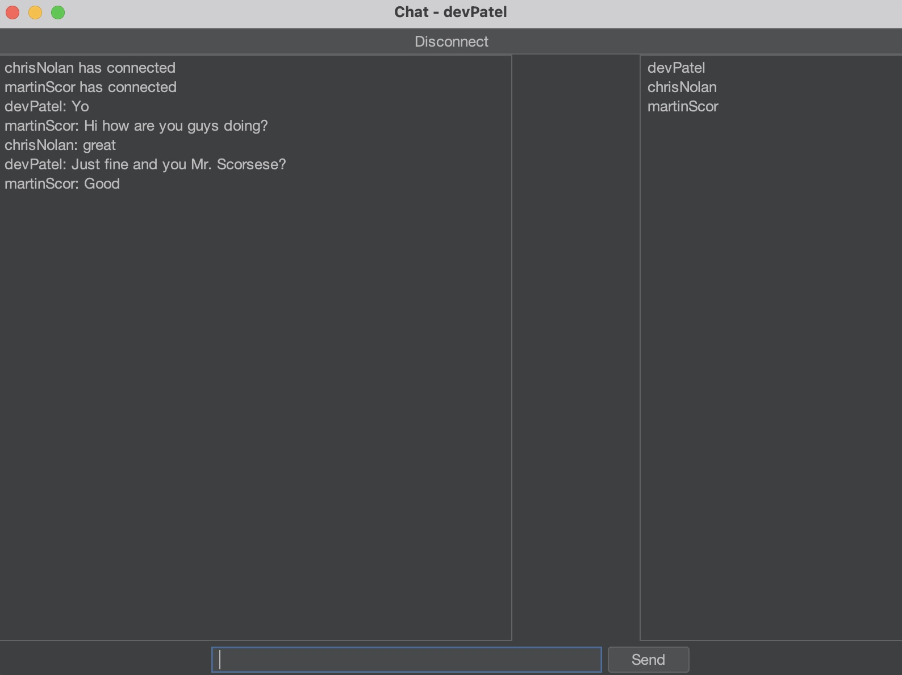

# Java Chat App UDP

## Description
This project is a simple messaging application built using Java and the User Datagram Protocol (UDP). The application's graphical user interface (GUI) is designed with Java Swing, providing an intuitive and user-friendly chat experience.

The primary purpose of this chat app is to demonstrate the implementation of network communication using UDP, offering a lightweight and efficient messaging platform. Unlike TCP, UDP does not guarantee message delivery, order, or duplicate protection, making it a suitable choice for real-time applications where speed is crucial.

## Key Features
- **Real-time Messaging**: Send and receive messages instantly with low latency.
- **Multicast Support**: Communicate with multiple users simultaneously using UDP multicast.
- **User-Friendly Interface**: Simple and intuitive GUI built with Java Swing.

## Screenshots

### Login Screen



### Chat Screen




## How to Run

1. Clone the repository to your local machine.

```bash
git clone https://github.com/petterssonb/JavaChatAppUDP.git 
```

2. Navigate to the project directory.

```bash
cd JavaChatAppUDP
```

3. Run the app:

 - Run Main.java in your IDE.
 - Choose a username and click "ok".
 - Start chatting!


## Network Interface Configuration

Be sure to change the network interface from "en0" (en0 is common for MacOS) to what network inerface you have on your device.
You find where to change network interface on line 15 inside MulticastCollector.java:

```java
NetworkInterface netIf = NetworkInterface.getByName("change here");
```

To check which network interface you have on your device, you can run the following command in the terminal:

 #### MacOS:
```bash
networksetup -listallhardwareports
```

 #### Windows (Powershell):
```bash
Get-NetAdapter
```


## External libs used:

 ##### Flatlaf:

[Flatlaf Github Repository](https://github.com/JFormDesigner/FlatLaf?tab=readme-ov-file)
